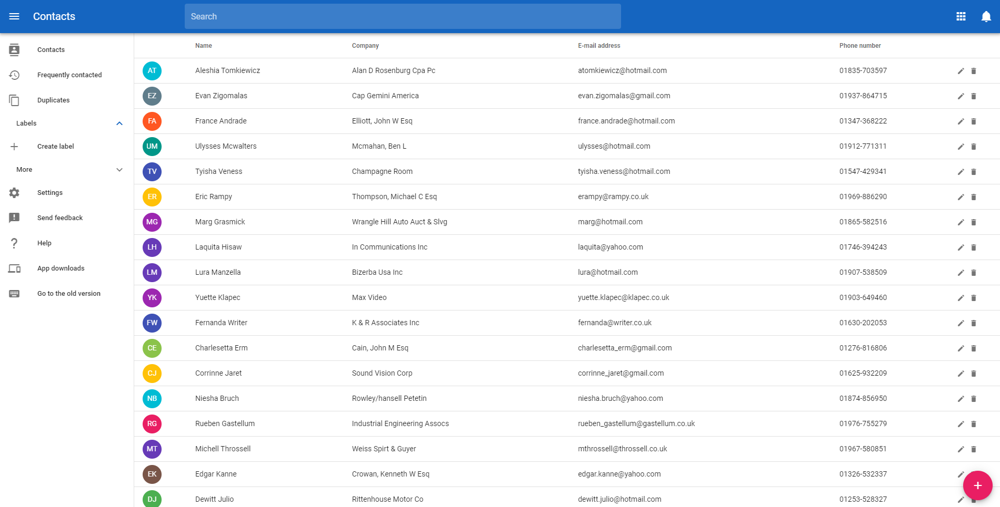
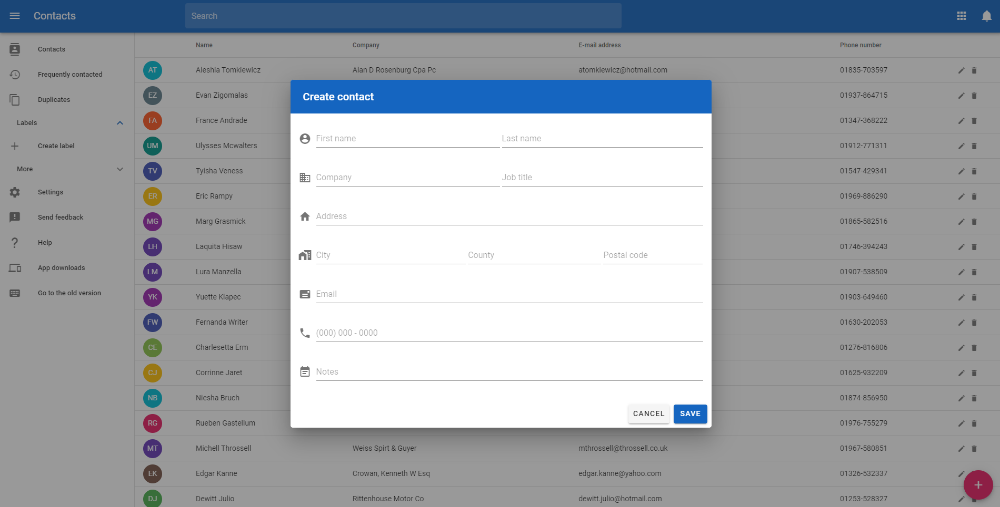

<div style="text-align: center;">
  <h1>Contacts</h1>
  <strong>A Contacts webapp built using Vue.js and Vuetify.</strong><br/>
  <p>
    
  </p>
  <p>
  Contacs is a sample webapp built with <a href="https://vuejs.org/">Vue.js</a> and <a href="https://vuetifyjs.com/">Vuetify</a> as a simple grid of contacts with creating and editing capabilities.
  </p>
  <p>
    
  </p><p>
    
  </p>
</div>

## 📖 Project setup
To setup for development, checkout the project and run:
```sh
# Installs dependencies
npm install
```

### 🖥️ Local development
```sh
# Compiles and hot-reloads for development
npm run serve
```

### 🧪 Testing and linting
```sh
# Lints and fixes files
npm run lint
```

### 📦 Building for production
```sh
# Compiles and minifies for production
npm run build
```

### Customize configuration
See [Configuration Reference](https://cli.vuejs.org/config/).
